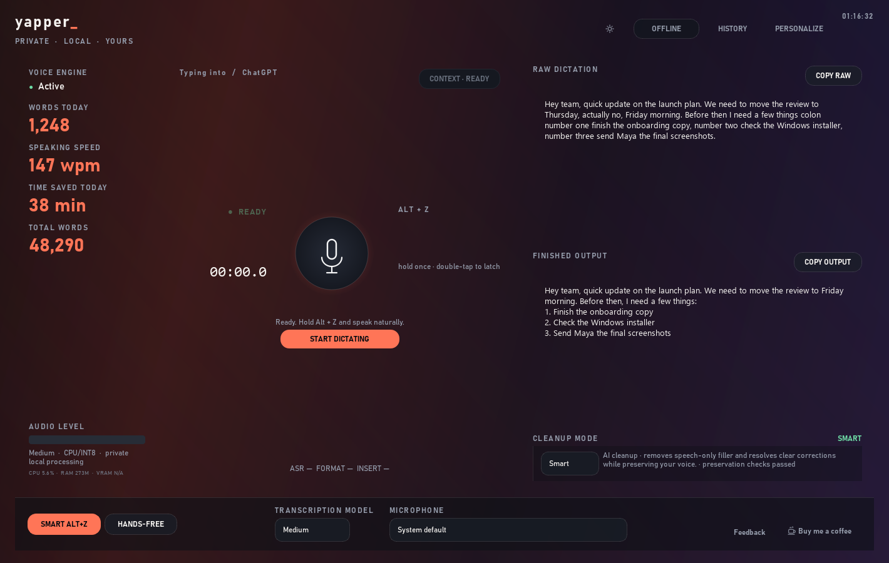

# yapper_ 4.0

**Yapper: the open-source wrapper you don't need to pay for.**

Because paying a monthly subscription for a wrapper around great open-source
tools felt ridiculous.

yapper_ is a free, open-source, offline-first Windows dictation application
published by Nimbus. It records from a chosen microphone, transcribes locally
with Faster-Whisper, applies optional cleanup, and inserts the result into the
active application.

**Transparency note:** Yapper was vibe-coded with an LLM as a coding
contributor. Nimbus shaped the idea, product direction, personality, and testing.

Version 4.0 is the clean release baseline. Application resources, personal
data, downloaded models, development tools, and generated release artifacts
are deliberately separated.

## Download for Windows

**[Download the Yapper 4.0 Windows installer](https://drive.google.com/drive/folders/1zj7320R444bluO8H1Z6PfbQ57_kKFGqO?usp=sharing)**

For normal Windows installation, download and run `Yapper-4.0.0-Setup.exe`
from the linked folder. Git and Python are not required.

## What the hell is Yapper?

Yapper is a free, open-source, local-first dictation app for Windows. Press a
hotkey, speak naturally, and Yapper turns the resulting verbal chaos into clean
text inside whichever app you are using.

It uses Faster-Whisper for local speech recognition and can optionally use a
local Gemma model for cleanup. No subscription is required. Python is bundled.
Your friend should be able to install it without receiving a computer-science
degree first.



## Why does this exist?

I kept seeing excellent open-source tools wrapped in polished interfaces and
sold back to people as wild monthly subscriptions. That felt ridiculous.

So I made an open-source wrapper of my own.

**A wrapper, yes. A rent-seeking wrapper, no. Open source for open source.**

Yapper began as my personal attempt to build a free, inspectable alternative to
subscription dictation tools such as Wispr Flow. It is an independent project
and is not affiliated with Wispr Flow.

## Things Yapper does

- Dictates into almost any Windows app with a global hotkey.
- Transcribes locally with Faster-Whisper.
- Cleans punctuation, lists, corrections, and formatting.
- Offers optional local Gemma cleanup without rewriting your personality.
- Remembers your vocabulary, replacements, snippets, and preferences.
- Keeps a searchable local history.
- Supports optional online formatting providers if you explicitly configure one.
- Includes Tiny, Medium **(Recommended)**, and Gemma model downloads inside the app.
- Runs on CPU and uses compatible NVIDIA hardware when available.
- Charges exactly zero recurring monthly bills.

## A couple things before you yap

Windows may show a publisher warning because the current installer has not yet
been digitally signed. The source and reproducible Windows packaging files are
available in this repository for inspection.

On first launch, Yapper offers Tiny, Medium **(Recommended)**, and Gemma. All
three are selected initially, but you can uncheck anything or skip the setup.
Gemma has its own Google license and requires your own Hugging Face read token.

## Privacy, because obviously

By default, recordings, transcripts, settings, personalization, and history
stay on your computer under `%LOCALAPPDATA%\Nimbus\Yapper`.

Model downloads contact their publishers. An online cleanup provider is
contacted only if you enable and configure one. Feedback, diagnostics, and
selected transcripts are opt-in, off by default, and never sent automatically.
The Send data tab prepares a readable report and opens a Google Form; you still
review and upload the file yourself.

Read the full [privacy notes](docs/PRIVACY.md).

## Help make Yapper less dumb

Real voices, accents, microphones, names, and spectacularly messy sentences
are the only way this gets better. If you are comfortable, use the in-app
feedback tools to share anonymous diagnostics or a dictation you deliberately
select. You see what is being shared, and you remain in control.

Bugs, ideas, cleanup disasters, and unexpectedly brilliant results are all
welcome in [GitHub Issues](https://github.com/nimbus890/Yapper/issues).

## Who made this?

Yapper is a first project created and directed by **Nimbus**. It was vibe-coded
with an LLM as a coding contributor; Nimbus shaped the idea, product direction,
personality, and testing.

In other words: human taste, machine assistance, an unreasonable number of
iterations, and somehow a real Windows installer at the end.

## For people who actually want the code

Use 64-bit Python 3.11:

```powershell
python -m venv .venv
.\.venv\Scripts\python.exe -m pip install -r requirements-semantic.txt
.\.venv\Scripts\python.exe main.py
```

Run the regression suite:

```powershell
.\.venv\Scripts\python.exe -m unittest discover -s tests -v
```

Build the bundled Windows app and installer:

```powershell
.\packaging\build.ps1
```

Python is bundled into the finished app. CUDA drivers are not installed or
modified by Yapper. Trusted Authenticode signing requires a real code-signing
certificate; see the [code-signing guide](docs/CODE_SIGNING.md).

<details>
<summary><strong>Project layout, for the curious</strong></summary>

```text
aura_flow/          application package
assets/             packaged icons, media, and other resources
docs/               privacy, installer, media, and design documentation
packaging/          Windows executable and installer definitions
tests/              automated regression suite
tools/              development and evaluation utilities
main.py             application and packaged-helper entry point
setup_models.py     transactional speech-model installer
setup_semantic.py   gated Gemma installer
```

Personal data, downloaded models, development tools, and generated release
artifacts are deliberately separated from the source tree.

</details>

## The fine print

Yapper's source code is available under the [MIT License](LICENSE). Dependencies,
downloaded models, and optional media keep their own licenses and terms. See the
[third-party notices](THIRD_PARTY_NOTICES.md) and [media notice](docs/MEDIA_NOTICE.md).

Use it. Improve it. Fork it. Just don't put it behind a wild monthly bill and
pretend we learned nothing.
